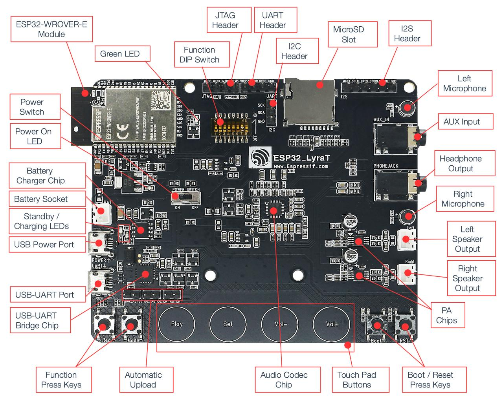

# Desenvolvendo aplicações para audio com o ESP32

## ESP-ADF x ESP-IDF 
### _ESP-ADF (Espressif Audio Development Framework)_
O ESP-ADF (Espressif Audio Development Framework) é um framework de desenvolvimento de software de código aberto desenvolvido pela Espressif. Foi projetado especificamente para criar aplicações de áudio em dispositivos baseados no ESP32, uma plataforma de microcontrolador de baixo custo e baixo consumo de energia.

O ESP-ADF fornece uma variedade de componentes e bibliotecas de software para facilitar o desenvolvimento de aplicativos de áudio. Ele oferece suporte para recursos como reprodução de áudio, gravação de áudio, processamento de áudio em tempo real, reconhecimento de voz e muito mais.

Os recursos suportados pelo framework ESP-ADF documentados mais precisamente no link:
https://github.com/espressif/esp-adf/tree/master

### _ESP-IDF (Espressif Iot Development Framework)_

A Espressif fornece os recursos básicos de hardware e software que ajudam os desenvolvedores de aplicativos a desenvolver suas ideias utilizando o hardware da série ESP32. O ESP-IDF destina-se ao desenvolvimento rápido de aplicativos de Internet das Coisas (IoT), com Wi-Fi, Bluetooth, gerenciamento de energia e vários outros recursos do sistema embarcado.

Para utilizar o framework ESP-ADF é preciso configurar primeiramente o ESP-IDF (Espressif IoT Development Framework)

## Hardware

## Hands-On
A aplicação demonstrada nesse exemplo recebe e transmite áudio via Bluetooth para um dispositivo (ex: Smartphone).

É capaz de atender/desligar ligações e controlar mídias.

Foi utilizado o A2DP bluetooth profile junto com HFP profile para desenvolvimento dessa aplicação

## Configurando o ambiente de desenvolvimento
Este exemplo será mais focado na configuração do framework ESP-ADF que depende do ESP-IDF já amplamente difundido :

- PC com Linux Ubuntu 20.04.2 LTS
- ESP-IDF release/v4.4
- ESP-ADF master
- Dev board Lyrat V4.3

### Passo 1 - configurando ESP-IDF
Para instalar e configurar corretamente o framenwork ESP-IDF basta seguir a documentação oficial:

https://docs.espressif.com/projects/esp-idf/en/latest/esp32/get-started/index.html

Se atentar a versão que é compatível com o ESP-ADF:

https://espressif-docs.readthedocs-hosted.com/projects/esp-adf/en/latest/get-started/index.html

### Passo 2 - configurar o ESP-ADF

